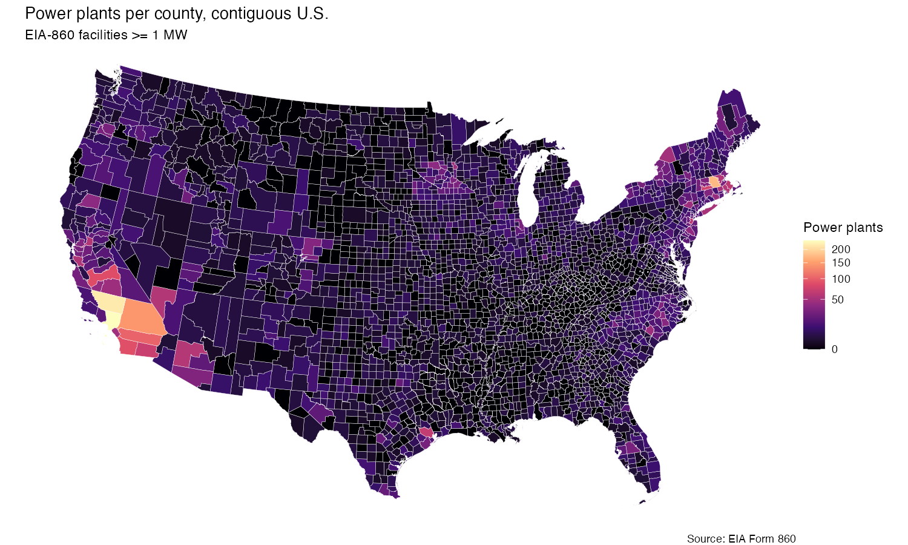
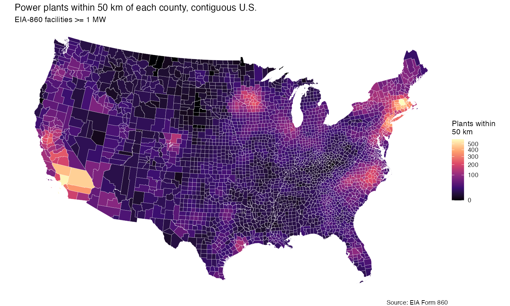
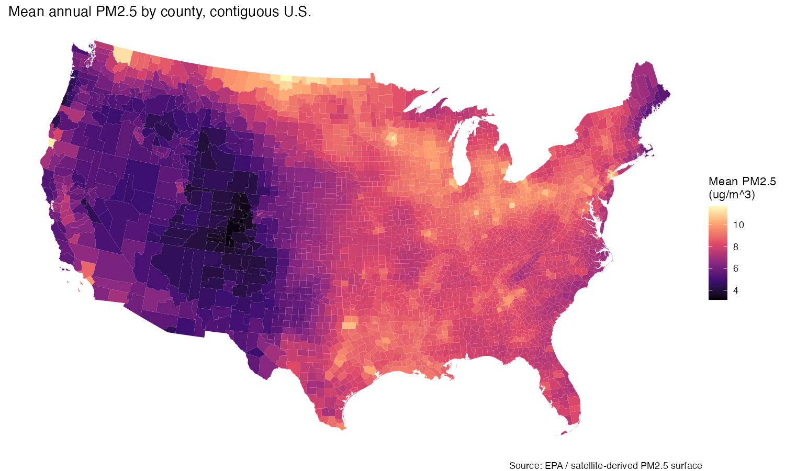
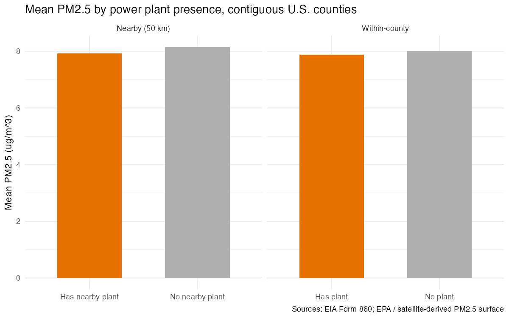

---
header-includes:
  - \usepackage{float}
  - \floatplacement{figure}{H}
---

# Day 6 Activity — Brief

**Author:** Winn Philpott  
**Date:** 2026-06-02

## Overview
PM2.5s are a common air pollutant that are harmful to breathe in. PM2.5s are emitted by many industrial facilities, including power plants. Understanding the distributional effects of power plants on PM2.5 levels within the United States can help inform policy and regulations, especially if that information is easily digestable and shareable. 
This brief explores county-level power plant spatial data within the contiguous United States. First, the number of power plants within each county is visualized on a choropleth. Next, a radius of 50km is extended from each power plant and any county that is within that circle is counted as "nearby" -- a new choropleth shows how many power plants are within 50km of each county. Finally, a choropleth reports each county's mean PM2.5 levels. Those levels are compared between counties with and without power plants; the same is done using the "nearby" measure in the same bar chart. 

## Power plants per county

Throughout the contiguous United States, the vast majority of counties have 50 or fewer power plants within them. The median number of power plants in a county is 1, and the mean is slightly less than 4. Most counties are close to the mean with a standard deviation of about 10, and Los Angeles County has the maximum of 237 power plants. Counties with higher-than-average numbers of power plants are primarily in southern California, the Northeast, North Carolina, the Twin Cities, and the Houston area. These data are visualized in outputs/map_plants_per_county.png. 

## Nearby plants (50 km buffer)

Figure 1 helps show where the power plants themselves are but does not fully describe the potential impact of PM2.5s emitted by the power plants. The EPA classifies PM2.5 emitting facilities are "near-field" within 50km, sometimes more (EPA Citation). Therefore, any power plant within 50km of a given county is considered "nearby" for this brief. The second figure shows that many more counties without power plants are near at least one power plant. The median number of power plants nearby is 20 -- 20 times larger than the mean of power plants within counties. The mean is a little over 36 power plants nearby per county, though the standard distribution is about 53, indicating a wider spread than when only counting within-county power plants.

## Mean PM2.5 per county

At the county level, the maximum PM2.5 level is 11.74 and the lowest is 3.12. Compared to historical data of United States PM2.5 levels the distribution of the mean annual PM2.5 is pretty tight, centered around the mean and median of about 8. More densely-populated areas have higher levels, as visualized in Figure 3.

## Comparison: PM2.5 in counties with vs. without plants

### Within-county measure
The levels of PM2.5 in counties with and without plants is nearly identical -- both PM2.5 means are very close to 8. 

### Nearby measure
Using the nearby measure produces almost exactly the same image -- counties with and without nearby power plants have PM2.5 means of about 8.

## Sources
